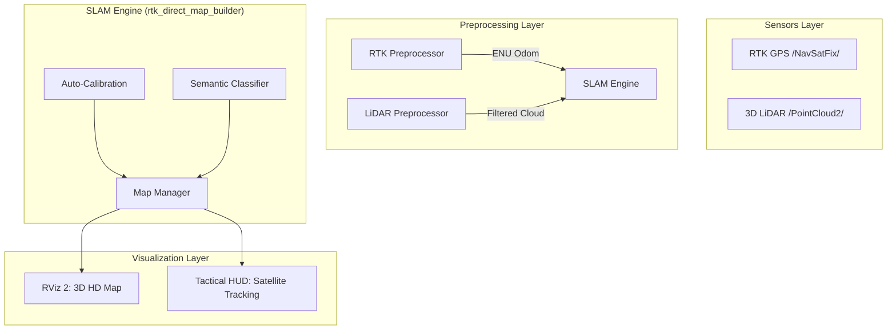

# AMR 2026: Advanced LiDAR-RTK SLAM Framework

A professional-grade SLAM (Simultaneous Localization and Mapping) framework developed for high-precision autonomous navigation in outdoor environments. This system leverages 3D LiDAR data and RTK-GPS fusion, specifically optimized for the ROS 2 Humble distribution.

---

## 1. System Architecture

The framework is built on a modular ROS 2 architecture, ensuring high-frequency data processing and robust sensor fusion. Below is the high-level data flow diagram:



---

## 2. Theory of Operation

### 2.1. Kinematic Auto-Calibration
Traditional SLAM systems require manual measurement of sensor extrinsics. This framework automates this through kinematic correlation.
*   **Vector Analysis**: The system analyzes the first 15 keyframes. It calculates the vehicle's displacement vector in the Earth-Centered frame (RTK).
*   **Sensor Cross-Correlation**: It identifies the primary axis of environmental returns in the LiDAR frame.
*   **Optimization**: By minimizing the error between the motion-derived heading and the point-cloud principal axis, the system identifies the exact yaw offset $(\Delta\psi)$ of the sensor mount.

### 2.2. Semantic Geometric Labeling
The framework moves beyond "blind" mapping by assigning semantic meaning to geometric structures without using expensive neural networks.
*   **DBSCAN Clustering**: Clusters dense returns into discrete objects.
*   **Morphological Heuristics**: 
    - **Poles/Infrastructure**: Verticality ratio $> 2.2$ and width $< 0.6m$.
    - **Vegetation**: Irregular density clusters with non-planar surfaces.
    - **Structural Walls**: Wide planar surfaces ($width > 4.0m$).

### 2.3. Geodetic Fusion (WGS84 -> ENU)
To maintain spatial consistency for mapping, the system converts global coordinates into a local Flat-Earth projection:
*   **Projection**: Uses the WGS84 ellipsoid parameters to project $(\phi, \lambda, h)$ into local $(e, n, u)$ Cartesian coordinates.
*   **Lever-Arm Correction**: Computes the 3D translation from the antenna to the vehicle's center of rotation to prevent orientation-induced translation errors.

---

## 3. The SLAM Pipeline

### Phase I: HD Mapping (V1)
In the Mapping Phase, the system focuses on high-fidelity environment reconstruction.
1.  **Keyframe Logic**: Data is only integrated when the vehicle moves $>3m$, preventing map over-saturation when stationary.
2.  **Voxel Grid Integration**: Points are stored in a centralized voxel grid to maintain a uniform density and prevent memory leaks.
3.  **Semantic Coloring**: Every point is assigned a color code representing its classified category (Building, Tree, Pole).

### Loop Closure & Transition
The system continuously monitors its Euclidean distance from the origin.
*   **Engagement**: Once the total distance traveled exceeds 80 meters.
*   **Detection**: If the current position enters a 15-meter radius of the starting point.
*   **Action**: The Mapping Phase is disabled, and the current map is serialized to a `.ply` file.

### Phase II: Localization (V2)
Once transition occurs, the SLAM Engine switches to a static mode.
1.  **Pose Streaming**: High-frequency pose updates are published to the `/odom` and `/tf` topics.
2.  **Navigation Context**: The existing global map provides the static context for path planning without further updates.

---

## 4. Visualization & GUI

### RViz 2: High-Resolution 3D View
The primary visualization tool for structural analysis and map verification.
> **[INSERT IMAGE: Phase 1 Mapping Result]**
*   *Displays*: Semantic cloud, Trajectory, Semantic Segments.

### Tactical Mission Control (HUD)
A custom-built Python interface designed for mission monitoring.
> **[INSERT IMAGE: Tactical HUD Screenshot]**
*   **Satellite Overlay**: Uses ESRI World Imagery tiles.
*   **Inverse Projection**: Trajectories are converted from ENU back to LLA for exact satellite alignment.
*   **Telemetry Panel**: Real-time Speed (km/h), Heading (deg), and Phase Status.

---

## 5. Technical Specifications

| Feature | Specification |
| :--- | :--- |
| **Middle-ware** | ROS 2 Humble Hawksbill (LTS) |
| **Localization Accuracy** | < 10cm (RTK dependent) |
| **Processing Delay** | < 50ms per keyframe |
| **Output Formats** | PLY (Colored Cloud), NMEA/ENU Odometry |
| **Dependencies** | Open3D, NumPy, Matplotlib, SciPy, Pillow, Requests |

---

## 6. Installation & Deployment

### 1. Prerequisite Installation
Ensure a standard ROS 2 Humble setup. Install extended Python libraries:
```bash
pip install numpy open3d scipy matplotlib requests Pillow
```

### 2. Workspace Setup
```bash
# Clone the repository into your src folder
cd amr_2026_research_m&l
colcon build --symlink-install --packages-select lidar_rtk_slam
source install/setup.bash
```

### 3. Running the Framework
```bash
# Launch the full stack including Preprocessors, SLAM, RViz, and Tactical HUD
ros2 launch lidar_rtk_slam rtk_direct_slam.launch.py
```

---

## 7. Future Work
*   *Multi-agent mapping support.*
*   *Real-time mesh generation from semantic clusters.*
*   *Integration with MoveIt 2 for autonomous obstacle avoidance.*

---
**Lead Author**: Alfonso  
**Project**: AMR 2026 Research Division  
**Context**: Advanced Geospatial Localization & Persistent 3D Environment Reconstruction
