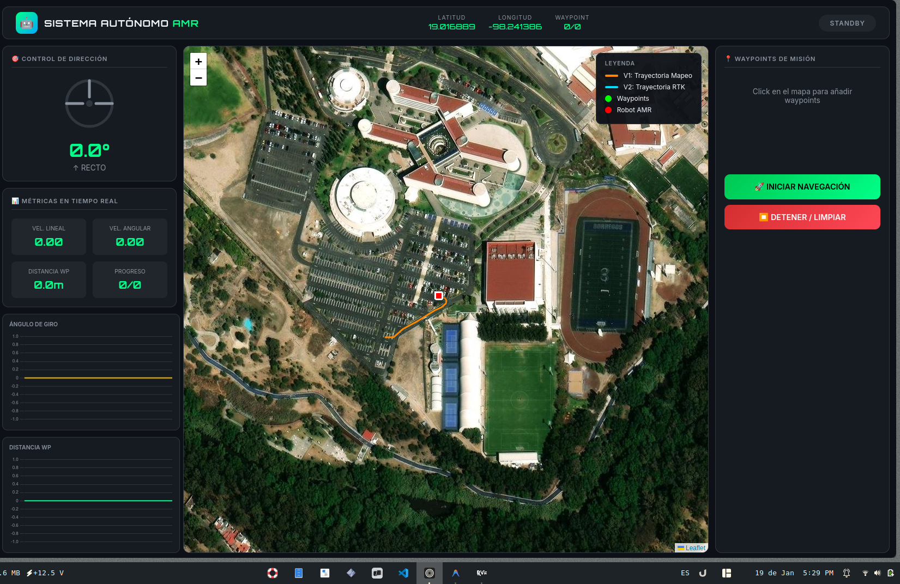

# 🤖 AMR 2026 Research - Mapping & Localization

## Autonomous Mobile Robot Navigation System

Sistema de navegación autónoma para AMR (Autonomous Mobile Robot) utilizando RTK-GPS, LiDAR y ROS2.

---

## 🎯 Características Principales

### 📍 Navegación Autónoma
- **Pure Pursuit Controller** con modelo de bicicleta cinemático
- Límite de steering: ±17.5°
- Lookahead dinámico basado en velocidad
- Velocidad adaptativa en curvas

### 🌐 Dashboard Web
- Interfaz web profesional ("Sistema Autónomo AMR")
- Visualización de trayectorias V1/V2 en mapa satelital
- Gráficas en tiempo real (steering, velocidad, distancia)
- Control de waypoints interactivo

### 🛰️ Sensores
- **RTK-GPS**: Localización centimétrica
- **LiDAR Velodyne VLP-16**: Mapeo 3D
- **Odometría**: Fusión de sensores

---

## 🎬 Demos Visuales

### 📍 Fase 1: Mapeo 3D con LiDAR (RViz)

Visualización del mapeo en tiempo real con el sensor Velodyne VLP-16:


### 🛰️ Fase 2: Localización Satelital + Dashboard Web

Interfaz web "Sistema Autónomo AMR" con mapa satelital y trayectorias V1/V2:



---


## 📁 Estructura del Proyecto

```
amr_2026_research_m&l/
├── path_planning_autonomusNav/
│   └── lidar_rtk_nav/
│       ├── lidar_rtk_nav/
│       │   ├── tactical_autopilot.py      # Pure Pursuit Controller
│       │   ├── web_dashboard.py           # Dashboard Web AMR
│       │   ├── trajectory_tracker.py      # Trazador V1/V2
│       │   ├── motion_simulator.py        # Simulador de movimiento
│       │   └── static_map_server.py       # Servidor de mapa estático
│       ├── launch/
│       │   └── tactical_nav.launch.py     # Launch principal
│       └── rviz/
│           └── slam_pro.rviz              # Configuración RViz
└── README.md
```

---

## 🚀 Instalación

### Requisitos
- Ubuntu 22.04
- ROS2 Humble
- Python 3.10+

### Dependencias
```bash
sudo apt install ros-humble-nav2-msgs ros-humble-tf2-ros
pip install flask
```

### Compilación
```bash
cd ~/ros2_ws
colcon build --symlink-install --packages-select lidar_rtk_nav
source install/setup.bash
```

---

## 🎮 Uso

### 1. Simulación con Bag (datos grabados)
```bash
source install/setup.bash
ros2 launch lidar_rtk_nav tactical_nav.launch.py
```

### 2. Abrir Dashboard Web
Navegador: **http://localhost:5000**

### 3. Agregar Waypoints
- Click en el mapa para agregar waypoints
- Click "INICIAR NAVEGACIÓN" para comenzar

---

## 🔧 Controlador Pure Pursuit

### Modelo de Bicicleta Cinemático

```
Curvatura:   κ = 2·sin(α) / Ld
Steering:    δ = atan(L · κ)
Vel. Angular: ω = v·tan(δ) / L
```

### Parámetros

| Parámetro | Valor | Descripción |
|-----------|-------|-------------|
| `wheelbase` | 1.0 m | Distancia entre ejes |
| `max_steering_deg` | ±17.5° | Límite de giro |
| `max_velocity` | 1.0 m/s | Velocidad máxima |
| `lookahead_min` | 2.0 m | Lookahead mínimo |
| `lookahead_max` | 6.0 m | Lookahead máximo |
| `goal_tolerance` | 2.0 m | Tolerancia de llegada |

---

## 🌐 Dashboard Web

### Layout
```
┌────────────────────────────────────────────────────────────────┐
│  🤖 SISTEMA AUTÓNOMO AMR     Lat  Lon  WP    [STATUS]         │
├──────────────┬─────────────────────────────┬───────────────────┤
│ Control      │                             │ Waypoints         │
│ [Volante]    │       MAPA SATELITAL        │ [Lista]           │
│ Métricas     │   V1: Naranja, V2: Cyan     │ [INICIAR]         │
│ Gráficas     │   Robot: Rojo               │ [DETENER]         │
└──────────────┴─────────────────────────────┴───────────────────┘
```

---

## 📊 Topics ROS2

| Topic | Tipo | Descripción |
|-------|------|-------------|
| `/rtk/fix` | NavSatFix | Posición GPS RTK |
| `/rtk/odom_enu` | Odometry | Odometría ENU |
| `/cmd_vel` | Twist | Comandos de velocidad |
| `/slam/path_mapping` | Path | Trayectoria V1 |
| `/slam/path_localization` | Path | Trayectoria V2 |
| `/navigation/path` | Path | Waypoints de misión |
| `/autopilot/metrics` | Float32MultiArray | Métricas del autopilot |

---

## 👥 Equipo

- **Alfonso** - Desarrollo principal

## 📄 Licencia

MIT License - 2026

---

## 🔗 Referencias

- Coulter, R. Craig. "Implementation of the Pure Pursuit Path Tracking Algorithm"
- Snider, Jarrod M. "Automatic Steering Methods for Autonomous Automobile Path Tracking"
